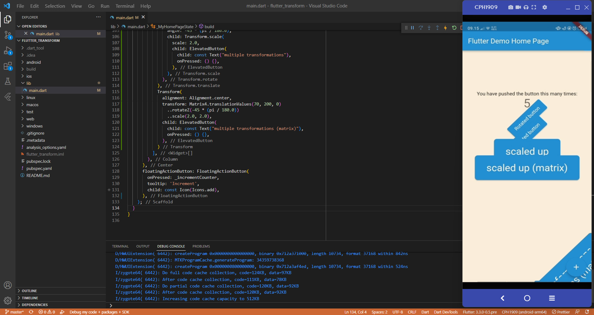
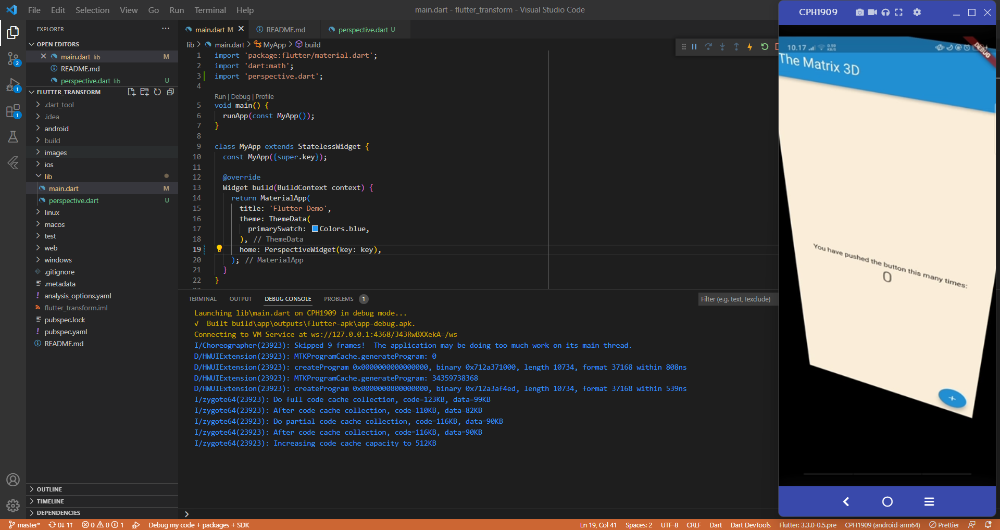
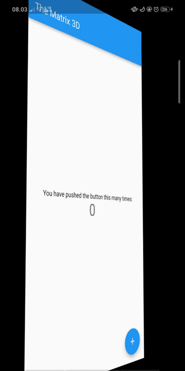
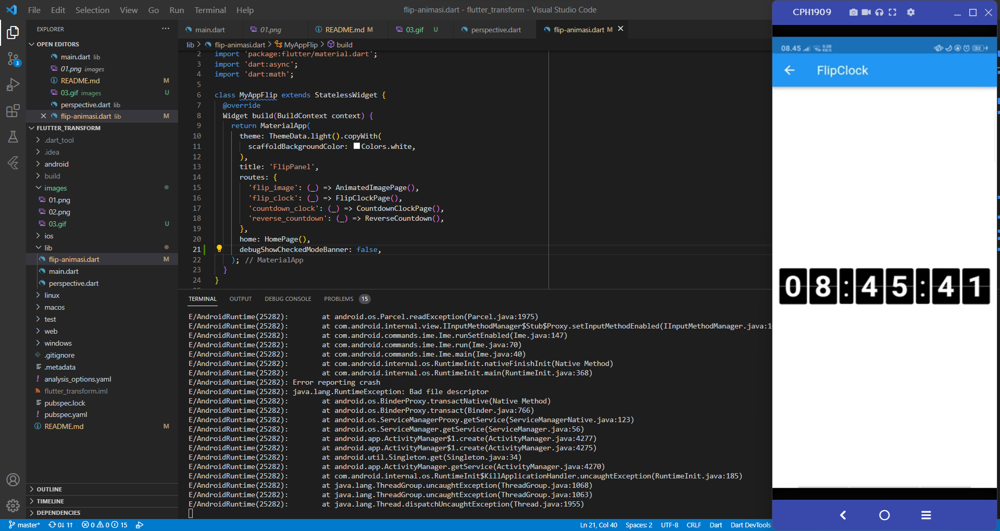
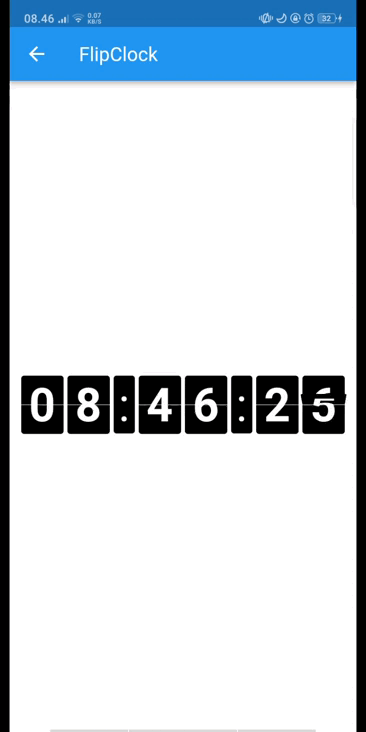

# flutter_transform

Praktikum Flutter Transform

## 1. Selesaikan Praktikum tersebut, lalu dokumentasikan dan push ke repository Anda berupa screenshot hasil pekerjaan beserta penjelasannya di file README.md!

## 2. Tetap di project yang sama, buatlah folder dan file dart baru lalu praktikkan kode yang ada di tautan ini terkait perspektif di flutter!

### Saat dijalankan di device

## 3. Tetap di project yang sama, buatlah folder dan file dart baru lalu praktikkan kode yang ada di tautan ini untuk membuat flip animasi 3D!

### Saat dijalankan di device
